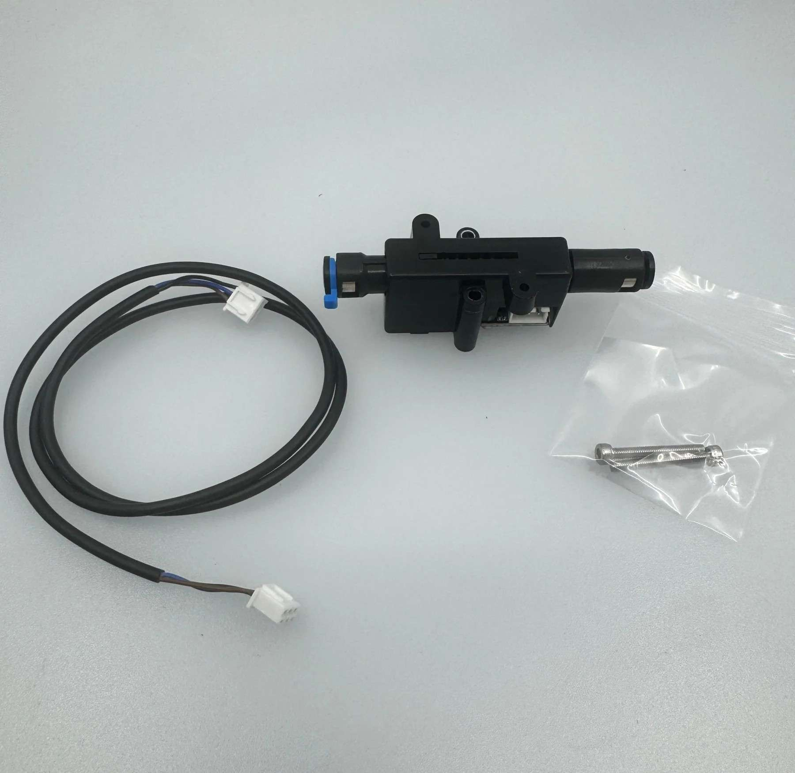

# Proportional Filament Sensor (PFS) — analog sync-feedback for Bunny Box

> [!NOTE]
> This has only been installed on a Qidi Plus4 so far, but nothing stops it being used on other printers — the Happy Hare config is generic, only the wiring and mounting are Plus4-specific. The mount is still a first pass (see [Mounting](#3-mounting--orientation)) and the spring is softer than the stock sensor, so expect some tuning. A better mount and reports from other printers are very welcome — open a PR or ping us on Discord.

A Proportional Filament Sensor (PFS) is a Hall-effect sync-feedback ("buffer") sensor for Happy Hare. Instead of a simple compression/tension switch it reports a continuous analog value of how compressed or tensioned the filament is between the MMU and the extruder. Happy Hare reads this on an ADC pin and uses it to keep the gear and extruder steppers in sync while printing (`sync_to_extruder`) and to drive FlowGuard clog/tangle detection. This is Happy Hare's analog / proportional (Type-P) feedback class — see the [Happy Hare sync-feedback docs](https://github.com/moggieuk/Happy-Hare/wiki/Synchronized-Gear-Extruder#---sync-feedback-sensor-options) for the theory.

Credit for the CAD files goes to [@fxwoody](https://www.youtube.com/@frankthebum)! ❤️ The sensor design itself is the [Proportional Sync Feedback Sensor by kashine6](https://github.com/kashine6/Proportional-Sync-Feedback-Sensor).

## Which Qidi printers

The Plus4 has a tension switch at the entrance to the heated chamber (stock firmware uses it as a tangle detector on `U_1:PC3`). Swapping it for a PFS gives Happy Hare proportional feedback instead of an on/off signal, for tighter syncing and more useful clog/tangle detection.

The Q2 and Max4 already ship with a hub-mounted tension sensor, but it is digital (a switch). That is good enough in practice — the gain from an analog sensor is not very important — so a PFS is more of a nice-to-have there. You can still fit one, but you will have to source your own ADC pin and mount.

## Requirements

- The PFS kit. Easiest is the [AliExpress kit](https://pl.aliexpress.com/item/1005010470743517.html) (Hall sensor, magnet, spring, hardware); or source the parts from the [original repo](https://github.com/kashine6/Proportional-Sync-Feedback-Sensor).
- The printed parts in [`./3D files/`](./3D%20files/) — `sensor-body`, `body-cap`, `piston` and `mounting-plate`. See [`assembly.png`](./3D%20files/assembly.png).
- A soldering iron. The PFS board ships connector, so you will either solder a connector onto it or solder the printer's sensor cable straight to the board (see [Wiring](#2-wiring)).
- Optional: a crimping tool and matching connector, if you would rather crimp the cable than solder to it.
- A little glue or resin to secure the board and provide strain relief.

## Hardware installation (Qidi Plus4)

### 1. Open the printer and remove the stock tension sensor

The stock sensor lives inside the heated chamber, at the point where the PTFE tube enters it. To reach it you have to take off the top plastic panel:

1. Remove the glass top.
2. Undo the 5 screws below the foam on the top panel. On older Plus4 units the foam may completely cover these screws — feel for the holes with something small (e.g. a hex key), then carefully slit the foam over each hole with a razor.
3. Undo the 4 screws holding the handles down.
4. Lift the top panel off and undo the 2 screws holding down the stock tension switch.
5. Disconnect or cut the cable on the stock tension switch.


### 2. Wiring

You can reuse the stock sensor's cable — it already carries everything the PFS needs: +5 V, GND and the signal on `U_1:PC3` (an ADC-capable pin on the toolhead MCU, the same pin the stock tangle switch used). How you connect depends on your unit, so identify your stock cable before you cut anything.

Newer Plus4 units have a cable that ends in a removable connector, and it should be possible to mate it with the PFS board and run the sensor without modifying the cable at all.

> [!WARNING]
> This is unconfirmed — please verify and report back! Nobody has yet confirmed that the connector and its pin order actually match the PFS board on a new unit. Check the pinout against the table below before powering on (a reversed +5 V / GND can kill the Hall sensor), then let us know what you find — open an issue or ping us on Discord so we can document it properly.



Older Plus4 units have a cable with no detachable connector. Cut it, strip the wires, and either crimp on a PFS connector or solder the wires straight to the PFS board.


Pin and colour mapping (both cases):

| PFS pin | Signal | Stock cable wire |
|---------|--------|------------------|
| top     | +5 V   | brown            |
| middle  | GND    | blue             |
| bottom  | SIG    | black            |

> [!WARNING]
> Wire colours could vary between batches — verify against your own cable before powering on. Swapping +5 V and GND can damage the Hall sensor.

### 3. Mounting & orientation

Orient the long neck towards the extruder; the spring naturally pushes the plunger that way, which is what you want. The PFS does not need to be bolted down — gluing it in place, or even leaving it hanging in the filament path, works fine.

> [!WARNING]
> The original tension-sensor pocket is very tight and the PFS connector may not physically fit in it. The author got it in by soldering the wires directly to the board (no connector) and securing it with a blob of resin for strain relief. If you mount the PFS anywhere other than the stock pocket, space is not a problem.

> [!NOTE]
> The printed enclosure was meant to drop into the stock pocket and reuse the original tension-sensor screw holes, but it does not fit well enough to use them. A redesign is planned — not a big deal, since the PFS does not need to be bolted down anyway.


## Software configuration

All paths below are relative to your printer's config directory (`~/printer_data/config/`).

### 1. `printer.cfg` — remove the stock sensor on `PC3`

A pin can only belong to one object, so delete (or comment out) the stock tangle switch, and any other section that claims `PC3`:

```diff
-[filament_switch_sensor fila]
-pause_on_runout: True
-runout_gcode:
-    M118 Filament tangle detected
-event_delay: 3.0
-pause_delay: 0.5
-switch_pin:U_1:PC3
```

### 2. `mmu/base/mmu_hardware.cfg` — declare the analog pin

In the `[mmu_sensors]` section, add the PFS. Start with the default scaling values; the real ones come from calibration in the next section.

```ini
[mmu_sensors]
# ... existing pre_gate / gate / extruder sensors stay as they are ...

sync_feedback_analog_pin: U_1:PC3        # ADC pin the PFS signal is wired to
sync_feedback_analog_max_compression: 1  # placeholder — set by MMU_CALIBRATE_PSENSOR
sync_feedback_analog_max_tension: 0      # placeholder — set by MMU_CALIBRATE_PSENSOR
sync_feedback_analog_neutral_point: 0.50 # placeholder — set by MMU_CALIBRATE_PSENSOR
```

### 3. `mmu/base/mmu_parameters.cfg` — enable sync feedback

```diff
-sync_feedback_enabled: 0
+sync_feedback_enabled: 1
```

Set the buffer travel to the physical plunger travel of the PFS (≈ 14.5 mm). `buffer_maxrange` also matters for calibration — it is the distance `MMU_CALIBRATE_PSENSOR` sweeps by default.

```ini
sync_feedback_buffer_range: 14.5     # PFS plunger travel (mm)
sync_feedback_buffer_maxrange: 14.5  # absolute end-to-end travel (mm)
sync_feedback_speed_multiplier: 5    # leave at defaults
sync_feedback_boost_multiplier: 3
sync_feedback_extrude_threshold: 5
```

Restart Klipper so the new sensor is picked up.

## Calibration

This follows the [Happy Hare proportional-sensor procedure](https://github.com/moggieuk/Happy-Hare/wiki/Synchronized-Gear-Extruder#---sync-feedback-sensor-options).

### Step 1 — sanity-check the sensor

With the placeholder values from above and Klipper restarted, run `MMU_QUERY_PSENSOR`. It prints something like:

```
PSENSOR Enabled: True  Value: 0.014  Raw Value: 0.538
```

Raw Value is the bare ADC reading (0 – 1); Value is the normalised feedback (−1 tension … +1 compression). Push and pull the plunger by hand (or jog the gear) and watch Raw Value sweep across most of the 0 – 1 range (roughly ~0.004 at one extreme to ~0.99 at the other). If it barely moves or stays pinned, your wiring or the ADC pin is wrong — fix that before calibrating.

### Step 2 — auto-calibrate

Load filament first (`MMU_LOAD`, or select a gate) — calibration refuses to run on an empty MMU or the bypass. Then run `MMU_CALIBRATE_PSENSOR`. Happy Hare drives the gear stepper in 2 mm increments in both directions, finds the compression and tension extremes, and prints recommended settings, e.g.:

```
[mmu_sensors]
sync_feedback_analog_max_compression: 0.0797
sync_feedback_analog_max_tension:     1.0000
sync_feedback_analog_neutral_point:   0.5398
```

Polarity depends on your wiring and orientation, so don't assume `max_compression` is the larger number — in the example above it is the smaller one. Just copy whatever the command reports; `neutral_point` is simply the midpoint of the two extremes.

We normally run the PFS as a symmetrical sensor: you want the plunger sitting around its mid point so neutral tension is in the centre of the sensing range. Calibrating from the middle and using the auto-set `neutral_point` is what gives you that.

> [!TIP]
> If calibration fails to find both limits, the plunger is probably already too tensioned or too compressed at the start. Nudge it back to roughly the middle of its range with small `MMU_TEST_MOVE MOVE=<mm>` moves (positive and negative values move the filament in opposite directions), watching the plunger position in the Happy Hare panel in Fluidd/Mainsail, then run the calibration again. You can also sweep further with `MMU_CALIBRATE_PSENSOR MOVE=<mm>` (1–100).

### Step 3 — apply

Copy the three reported values into `[mmu_sensors]` in `mmu_hardware.cfg`, replacing the placeholders from configuration step 2, and restart Klipper.

## Tuning notes

- Weaker spring, shorter travel. The PFS spring is softer and its travel is smaller than the stock Plus4 tension sensor. If you cut tips (Qidi's cutter sits before the extruder), the filament-tensioning move during a cut may now over- or under-tension. Re-check `variable_tension_length` in `mmu/mmu_macro_vars.cfg` → `[gcode_macro _MMU_CUT_TIP_VARS]` (default `15.0`) and adjust if cuts get worse after the swap.
- FlowGuard sensitivity. Proportional sensors can run a lower `flowguard_max_relief` than switch-based ones. Start at the shipped default, lower it for a more sensitive clog/tangle trigger, and raise it if you get false positives.

## References

- [Happy Hare — Synchronized Gear/Extruder & sync-feedback sensors](https://github.com/moggieuk/Happy-Hare/wiki/Synchronized-Gear-Extruder#---sync-feedback-sensor-options)
- [Proportional Sync Feedback Sensor (original repo, kashine6)](https://github.com/kashine6/Proportional-Sync-Feedback-Sensor)
- [PFS kit on AliExpress](https://pl.aliexpress.com/item/1005010470743517.html)
